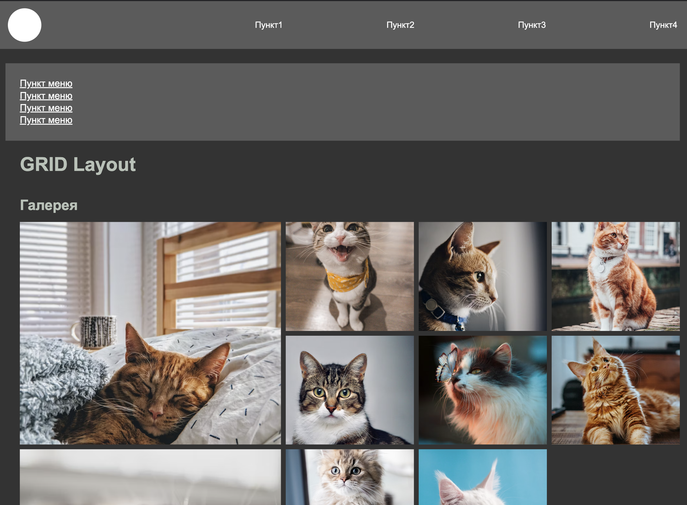
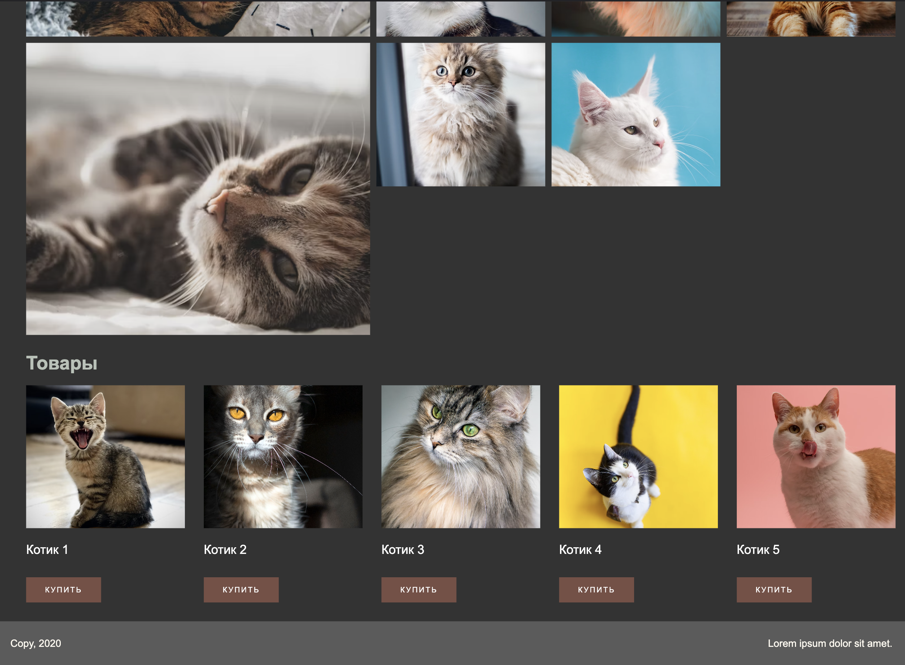
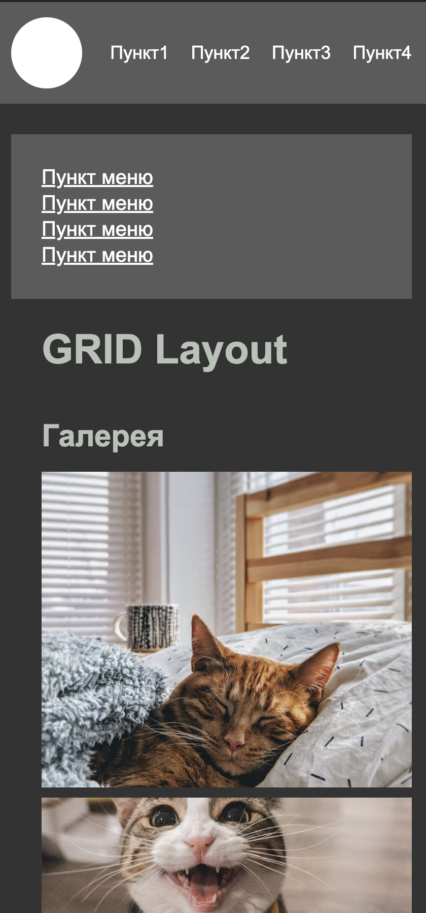

# HTML_CSS_Grid

### HTML-страница с CSS свойствами. Наличие адаптивной верстки, навигационной панели, набора картинок, карточек и подвала. 

### Page Home
#### *screenshot_page_width1440px(1)*

#### *screenshot_page_width1440px(2)*

#### *screenshot_page_width425px(1)*

#### *screenshot_page_width425px(2)*

#### *screenshot_page_width425px(3)*

#### *screenshot_page_width425px(4)*

